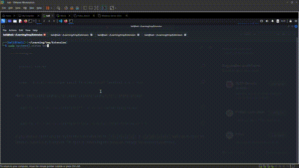

# VSCode-RemoteBreakout

## usage

```
python3 exp.py
```

```
code --install-extension Local-Terminal/Local-Terminal-0.0.1.vsix
```
**Note**: `this will install in local .vscode instead of .vscode-server`

```
sudo cp -r ~/.vscode/extensions/*  ~/.vscode-server/extensions
```

```
sudo rm -r ~/.vscode/extensions/local-terminal.local-terminal-0.0.1
```

If you know a better way to deploy this extension inside `.vscode-server` or `cursor-server`, feel free to open an issue or submit a pull request. I’m open to improving this proof-of-concept for research purposes.

## POC

